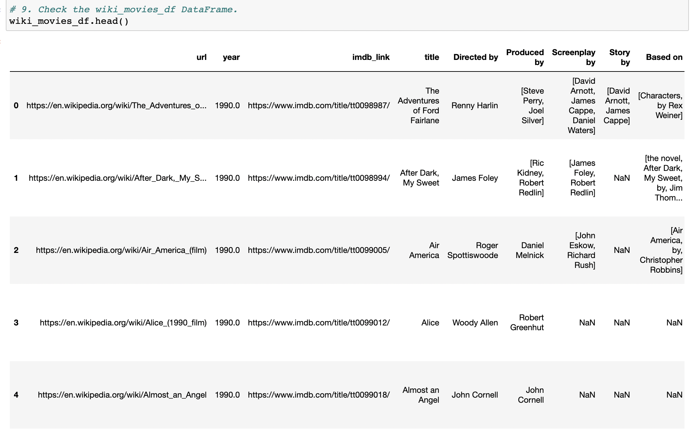
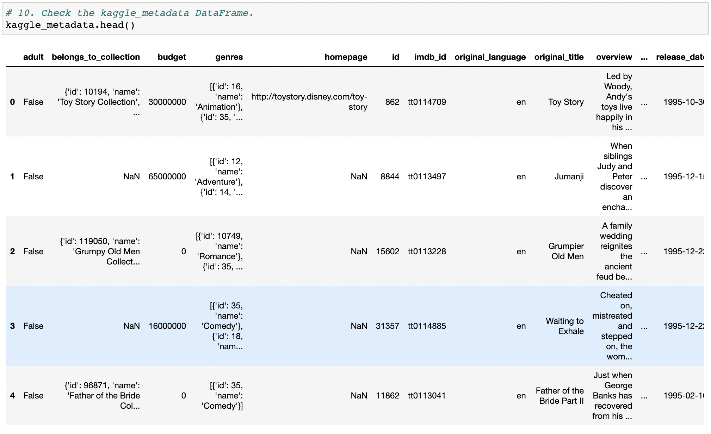
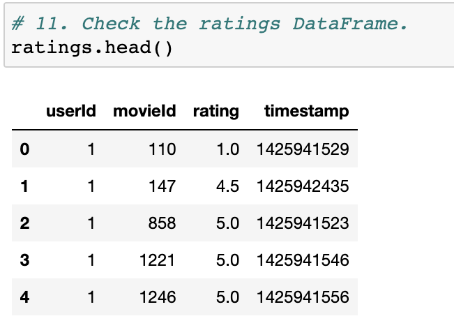
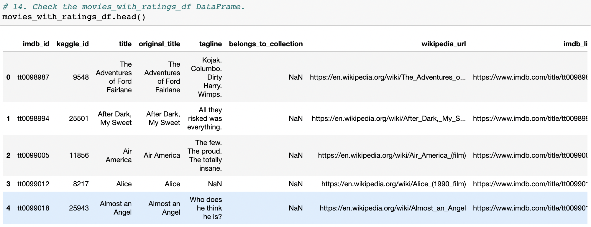
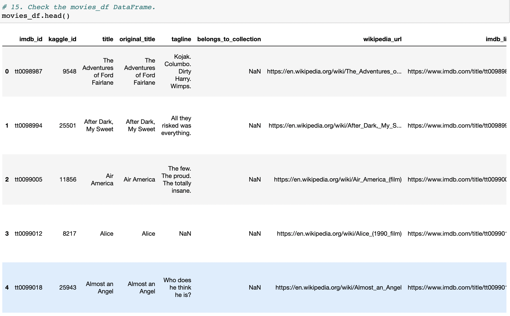
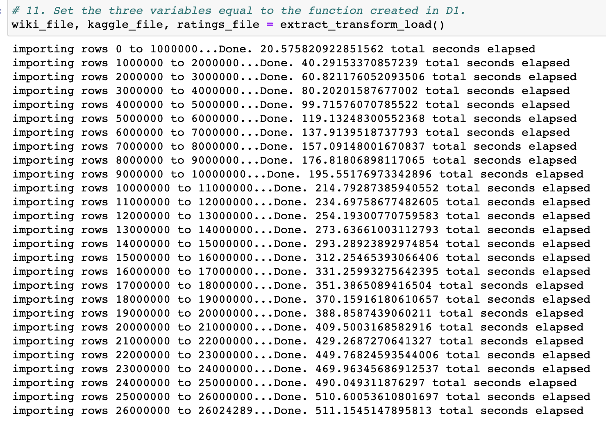

# Movies_ETL

## Background
In this challenge, I created an automated pipeline that takes in new data, performs the appropriate transformations, and loads the data into existing tables for Amazing Prime.

## Deliverable 1 

## Deliverable 2 

## Deliverable 3

Deliverable 4 

